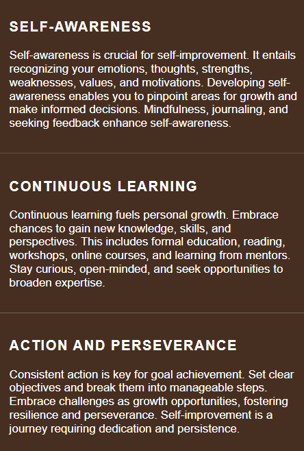

# 🌱 ElevateU
---
Welcome to the ElevateU, your go-to destination for practical self-improvement techniques and resources. Our website is dedicated to empowering individuals on their journey towards personal growth and development.
Your pocket-sized guide to personal growth and development. Our website is designed to provide you with simple yet effective tools and resources to help you become the best version of yourself.

## ⚙️Features:
📚 Comprehensive Guides: Dive into our library of comprehensive guides covering various aspects of self-improvement, including productivity, mindfulness, goal setting, and more.

- Whether you're striving for personal growth, seeking to enhance your well-being, or simply looking for inspiration to lead a more fulfilling life, the ElevateU community is here to support you every step of the way.

## 🚀Navigation Bar

Elegantly positioned at the top of each page, the navigation bar offers intuitive access to essential sections. On desktop screens, the navigation proudly showcases text links for "Home,🏠" More Content,📖" and "About Us,❓" seamlessly aligned to the right for effortless navigation.

## 🏠Home page

It contains an image of a very important quote for us to reflect on.

Also contains important content about self-improvement techniques.

## ↓Footer

It contains an important advice for the people seeking self-development.

## Features left to implement
I would like to add a webshop to the page to make it easy and fast for the users to enroll on my services. The webshop would contain of different packages to choose from when it comes to Nutrition and Personal Training.

## Unfixed bugs
No unfixed bugs

# Deployment
The site was created using Gitpod editor and pushed to Github to the remote repository 'Self-improvement-Techniques'.
Git commands were used throughout the development to push the code to the remote repository. The following git commands were used:

 - git 
add . to add the files to the staging area before being committed.

 - git commit -m "commit message" to commit changes to the local repository queue that are ready for the final step.
 
- git push to push all committed code to the remote repository on Github.
  
## Deployment to Github pages
-The site was deployed to Github pages as follows:
- From dashboard, select the project you'd like to create a deployment for.
- Select the Deployments tab. 
- Once on the Deployments page, select the Create Deployment button.
- Select Create Deployment. Vercel will build and deploy your commit or branch.

## 🧬Cloning of the Repository Code locally

- Go to the Github repository that you want to clone.
- Click on the Code button located above all the project files.
- Click on HTTPS and copy the repository link.
- Open the IDE of your choice and and paste the copied git url into the IDE terminal.
- The project is now created as a local clone.

## 🎥Media
- The images in the hero section and the content page were taken from [Unsplash](https://unsplash.com/s/photos/meditation).
- The icons used in the nav bar were taken from [Font Awesome](https://fontawesome.com/).

## 🏆Credits
- A special thanks to my Mentor for the support and answering all my Questions!
- Another special thanks to the Slack community for helping me fix the problems I had throughout the building of this project.

