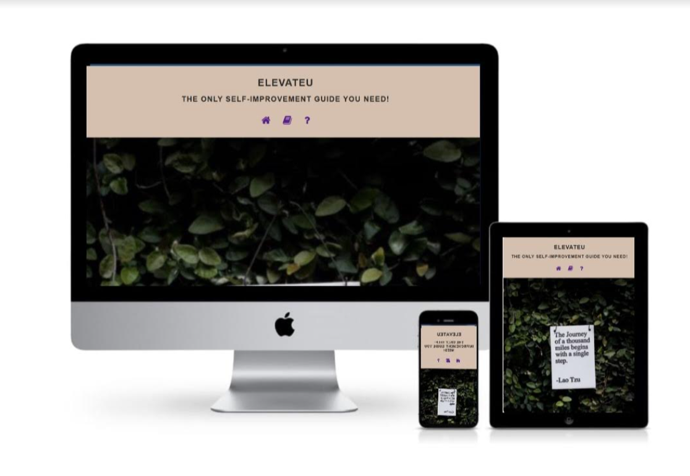
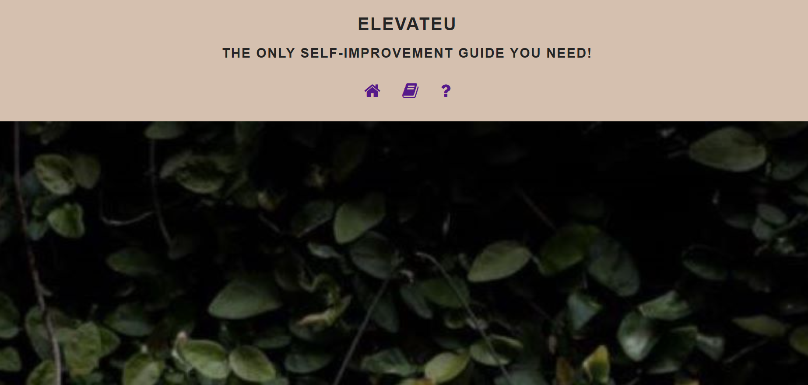
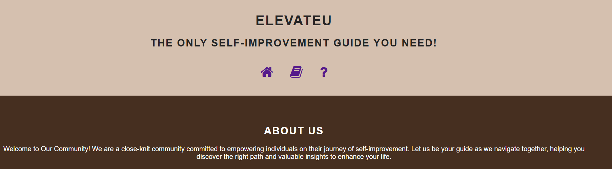
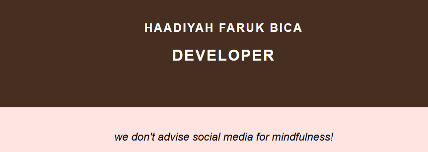

# 🌱 ElevateU
---
Welcome to ElevateU, your go-to destination for practical self-improvement techniques and resources. Our website is dedicated to empowering individuals on their journey toward personal growth and development. We offer simple yet effective tools and resources to help you become the best version of yourself.

Live link: [Self-Improvement-Techniques](https://hbica05.github.io/Self-Improvement-Techniques/) on GitHub Pages. 

## ⚙️Features:
📚 Comprehensive Guides
- Dive into our library of comprehensive guides covering various aspects of self-improvement, including productivity, mindfulness, goal setting, and more.
  
* **Productivity**: Techniques and tips to enhance your productivity.
* **Mindfulness**: Practices to cultivate mindfulness and reduce stress.
* **Goal Setting**: Strategies to set and achieve your personal and professional goals.
* **And More**: Discover additional resources tailored to personal growth.

- Whether you're striving for personal growth, seeking to enhance your well-being, or simply looking for inspiration to lead a more fulfilling life, the ElevateU community is here to support you every step of the way.

## 🚀Navigation Bar

The navigation bar is elegantly positioned at the top of each page, providing intuitive access to essential sections:

 - Home,🏠 : 

  

    - When clicked, it displays the top part of the homepage.
    	- Contains the title , and three navigation links.
  
  

 - More Content,📖:  
 
  

  - Directs to the content section of the homepage featuring self-improvement techniques.
  
  

 -  About Us,❓: 
   
  
 
    - Takes you to the About page where you can learn more about us and our mission.
    -  Highlights Haadiyah Faruk Bica, the developer, with a brief introduction.
 
  

## 🏠Home page
  ### ⭐ Main Features

- It contains an inspiring image with a quote by Lao Tzu for reflection.
  

  ### 🗺️ Layout
  * Home Page:
    - Three-Column Grid: Features cards for different self-improvement topics.

  

    - Two-Column Grid: Contains information about mindfulness meditation and associated visuals.
  
  

    - Also contains important content about self-improvement techniques, enhanced with visual elements.

  

  

  * About page:
  
  - Community Introduction: Welcomes users to the ElevateU community, outlining its mission and values.

 

  - Team Member Information: Highlights Haadiyah Faruk Bica, the developer, with a brief introduction.
  
  

## ↓Footer

The footer includes:

- Essential advice for individuals seeking self-development. 
  
- Displays the Copyright year.
  - The year in the footer updates automatically using JavaScript.
  
## Future Features to Implement
1. *Contact Page* : A dedicated page with a form for users to ask questions and get in touch.

2. *User Accounts*: Functionality for users to log in and manage their accounts.

3. *Additional Content*: More resources, guides, and images to enrich the website.
  
## 🐞 Bugs encountered
- During the development of this website, problems such as media queries not working for all screensizes were encountered. These were fixed with the help of accessing various resources and a lot of research.

- Adding images was also a problem, at the end I discovered that the file path to the image was not properly written in HTML code.
  
- The same with the Favicon. The Favicon was not appearing due to wrong file path stated in the HTML files.  
  
## Unfixed bugs
- No unfixed bugs reported at this time.

## Usage
1. Viewing the Site:

* Open index.html in a web browser to view the home page.
* Open about.html to view the about page.
  
2. Customizing Content:

* Edit index.html and about.html to update text, images, or other elements as needed.
* Modify style.css to change the appearance and layout of the website.

3. Updating JavaScript:

* The JavaScript in the HTML files dynamically updates the copyright year. Adjust this script if necessary for other dynamic content.

## 🗂️ Version Control
The following Git commands were used throughout the development:

 - `git add .`: Adds files to the staging area before committing.
  
 - `git commit -m "commit message"`: Commits changes to the local repository with a descriptive message.
 
- `git push`: Pushes committed changes to the remote repository on GitHub.
  
## 🚀 Deployment to Github Pages
* This site was deployed to Github pages as follows:
  
  1. Navigate to the Settings tab of the GitHub repository.
  2. In the Source section, select Deploy from a branch.
  3. Choose the main branch and click Save.
  4. A link to the live website was provided.
  

## 🔍Testing
### Accessibility

- The pages were tested using Lighthouse to ensure that colors and fonts are easy to read and the site is accessible.
  
  

- I tested each navigation link as follows:

  - The home favicon
   
    

   navigation link redirects to the top section of the homepage.

  - The book favicon  
  
    

     when clicked redirects to the section with more content of the homepage.

  - The question mark favicon 

    

    when clicked redirects to the About page.
    
### HTML Validation
* Home Page: No errors found using the [W3C HTML Validator](https://validator.w3.org/nu/#file)

* About page: No errors found using the [W3C HTML Validator](https://validator.w3.org/nu/#file)

### CSS Validation
- No errors found using the [W3C CSS Validator](https://jigsaw.w3.org/css-validator/validator)

## 🌍 Compatibility
- This website is Mobile-friendly with responsive design for seamless use on smartphones and tablets.

- I tested in Microsoft Edge, Chrome, Firefox, Safari and all were supported.
  
## 🧬Cloning of the Repository Code locally
To clone the repository locally:

1. Go to the Github repository you want to clone.
2. Click on the Code button above the project files.
3. Select HTTPS and copy the repository link.
4. Open your IDE and paste the copied git url into the terminal.
5. The project will be created as a local clone.

## 🎥Media & 🏆Credits
- Images: The hero section and the content page images were sourced from [Unsplash](https://unsplash.com/s/photos/meditation).
  
- Icons: Navigation bar icons are from [Font Awesome](https://fontawesome.com/).
  
- Colors: The color palette was selected from [Coolors](https://coolors.co/f3ebe2-e6ccb2-e7ccb1-d5c0af-462f20-c79b7f)
  
- Learning Resources: [Code Institute learning materials](https://codeinstitute.net/) for comprehensive learning materials and guidance.
  
- [Inshot](https://www.inshot.com/) : Used to edit screenshots showing responsiveness of the Website. 
  
- [Media Genesis](https://responsivedesignchecker.com/) : Used to test for responsiveness of the Website.

- Deployment Platform: Github pages for seamless deployment and hosting.
  
- Inspiration: Ideas were influenced by this video: [this video](https://youtu.be/PlxWf493en4?si=WUNrHtULHowHcs6d)

- Coding guidance: Some code queries were answered through reading other people's queries in [StackOverflow](https://stackoverflow.com/)

- A special thanks to my Mentor **Spencer Barriball** for their support and guidance throughout the project.

- Gratitude to the Slack community for assistance in troubleshooting and resolving issues.

