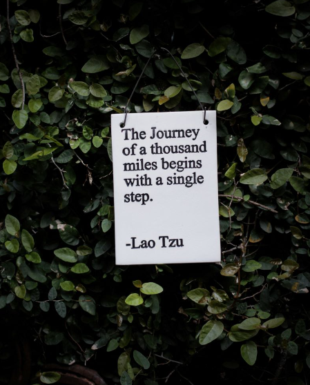
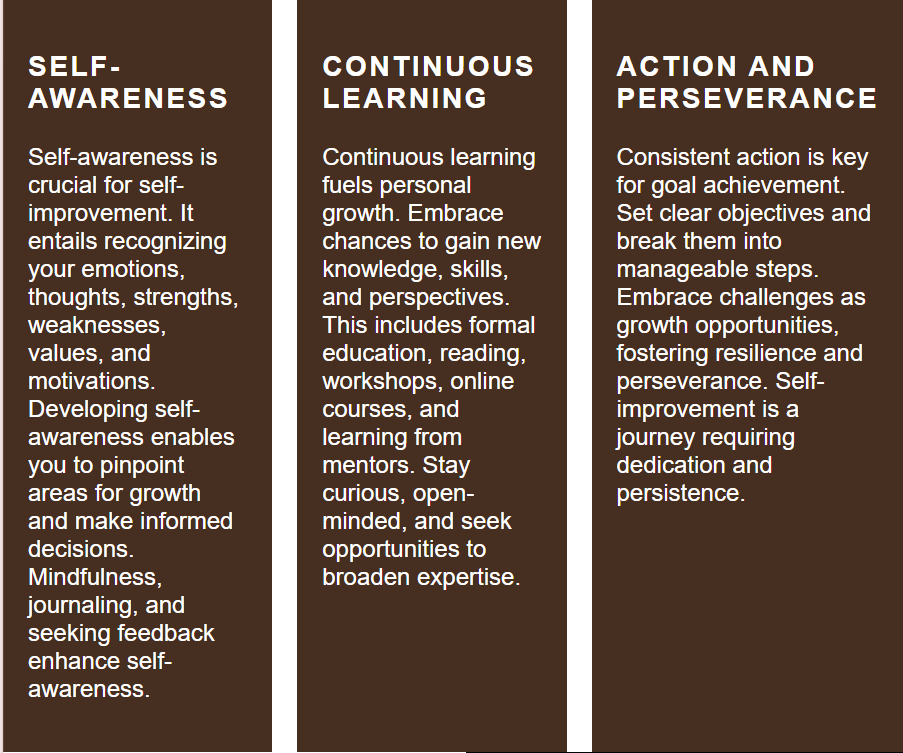

# 🌱 ElevateU
---
Welcome to the ElevateU, your go-to destination for practical self-improvement techniques and resources. Our website is dedicated to empowering individuals on their journey towards personal growth and development.
Your pocket-sized guide to personal growth and development. Our website is designed to provide you with simple yet effective tools and resources to help you become the best version of yourself.

## ⚙️Features:
📚 Comprehensive Guides: Dive into our library of comprehensive guides covering various aspects of self-improvement, including productivity, mindfulness, goal setting, and more.

- Whether you're striving for personal growth, seeking to enhance your well-being, or simply looking for inspiration to lead a more fulfilling life, the ElevateU community is here to support you every step of the way.

## 🚀Navigation Bar

Elegantly positioned at the top of each page, the navigation bar offers intuitive access to essential sections. On desktop screens, the navigation proudly showcases text links for: 

 - Home,🏠 : 

  

    - When clicked, it displays the top part of the homepage.
  
  

 - More Content,📖:  
 
  
  

    - When clicked, displays the content section in the homepage.
  
  

 -  About Us,❓: 
   
  
 
    - When clicked, displays the About page of the Website.
 
  

## 🏠Home page
- It contains an image of a very important quote by Lao Tzu, for us to reflect on.

- Also contains important content about self-improvement techniques, and pictures for more visual appeal.
  

## ↓Footer

- It contains an important advice for the people seeking self-development.
- It contains copyright information.

## Features left to implement
- I would like to add a contact page and a form, so that users can ask questions and login to their own account.
- I would also like to add more content and pictures to the website.

## Unfixed bugs
- No unfixed bugs

# Deployment
The site was created using Gitpod editor and pushed to Github to the remote repository 'Self-Improvement-Techniques'.
Git commands were used throughout the development to push the code to the remote repository. The following git commands were used:

 - git 
add . to add the files to the staging area before being committed.

 - git commit -m "commit message" to commit changes to the local repository queue that are ready for the final step.
 
- git push to push all committed code to the remote repository on Github.
  
## Deployment to Github pages
-The site was deployed to Github pages as follows:
- From dashboard, select the project you'd like to create a deployment for.
- Select the Deployments tab. 
- Once on the Deployments page, select the Create Deployment button.
- Select Create Deployment. Vercel will build and deploy your commit or branch.

## 🔍Testing
### Accessibility

- I ran the pages through Lighthouse and confirmed that the colors and fonts are easy to read and that the site is accessible.
  

### HTML Home page
- No errors found when running the code through the [W3C HTML Validator](https://validator.w3.org/nu/#file)

### HTML About page

### CSS
- No errors found when running the code through the [W3C CSS Validator](https://jigsaw.w3.org/css-validator/validator)

## 🧬Cloning of the Repository Code locally

- Go to the Github repository that you want to clone.
- Click on the Code button located above all the project files.
- Click on HTTPS and copy the repository link.
- Open the IDE of your choice and and paste the copied git url into the IDE terminal.
- The project is now created as a local clone.

## 🎥Media
- The images in the hero section and the content page were taken from [Unsplash](https://unsplash.com/s/photos/meditation).
- The icons used in the nav bar were taken from [Font Awesome](https://fontawesome.com/).
- The colours were taken from a colour palette in [Coolors](https://coolors.co/f3ebe2-e6ccb2-e7ccb1-d5c0af-462f20-c79b7f)
- **[Code Institute learning materials](https://codeinstitute.net/)**: For providing comprehensive learning resources and guidance throughout the development process.
- **[Github pages]**(): The platform provided seamless deployment and hosting services for the application.
- Some ideas were taken from this video: (https://youtu.be/PlxWf493en4?si=WUNrHtULHowHcs6d)

## 🏆Credits
- A special thanks to my Mentor for the support and answering all my Questions!
- Another special thanks to the Slack community for helping me fix the problems I had throughout the building of this project.

